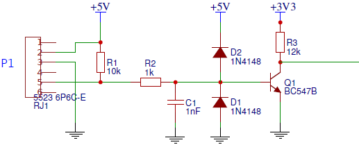

# P1-meter
This software is a Prometheus Node Exporter that reads the P1 port of a DSMR.

### Hardware used for the project
- Simple interface build on a test print board and connected with an RJ11 to the P1 port of my DSMR
- ESP8266 module from Aliexpress with 1 MB flash
- USB power supply to provide power to the interface and ESP8266 module 

### Diagram found on the internet (no idea who made it)

### Installation instrucions
- Setup the WiFi SSID and password 
- Check the data ports 
- You need some libraries like: ESP8266WiFi, SoftwareSerial
- Compile and flash

### Collection of data
I have been collecting data for a couple of months now and it is still working fine.